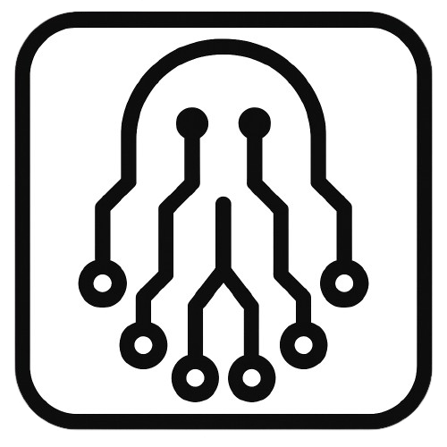

<div align="center">



# GHOSTCREW
### AI 渗透测试智能体

[](https://www.python.org/) [](LICENSE.txt) [](https://github.com/GH05TCREW/ghostcrew/releases) [](https://github.com/GH05TCREW/ghostcrew) [](https://github.com/GH05TCREW/ghostcrew)

[🇺🇸 English](README.md) | [🇨🇳 中文文档](README_zh.md)

</div>

https://github.com/user-attachments/assets/a67db2b5-672a-43df-b709-149c8eaee975

## 要求

- Python 3.10+
- OpenAI, Anthropic 或其他支持 LiteLLM 的提供商的 API 密钥

## 安装

```bash
# 克隆仓库
git clone https://github.com/GH05TCREW/ghostcrew.git
cd ghostcrew

# 设置 (创建虚拟环境, 安装依赖)
.\scripts\setup.ps1   # Windows
./scripts/setup.sh    # Linux/macOS

# 或者手动安装
python -m venv venv
.\venv\Scripts\Activate.ps1  # Windows
source venv/bin/activate     # Linux/macOS
pip install -e ".[all]"
playwright install chromium  # 浏览器工具需要
```

## 配置

在项目根目录创建 `.env` 文件:

```
ANTHROPIC_API_KEY=sk-ant-...
GHOSTCREW_MODEL=claude-sonnet-4-20250514
```

或者使用 OpenAI:

```
OPENAI_API_KEY=sk-...
GHOSTCREW_MODEL=gpt-5
```

任何 [LiteLLM 支持的模型](https://docs.litellm.ai/docs/providers) 都可以使用。

## 运行

```bash
ghostcrew                    # 启动 TUI (终端用户界面)
ghostcrew -t 192.168.1.1     # 启动并指定目标
ghostcrew --docker           # 在 Docker 容器中运行工具
```

## Docker

在 Docker 容器中运行工具，以实现隔离并使用预安装的渗透测试工具。

### 选项 1: 拉取预构建镜像 (最快)

```bash
# 基础镜像 (包含 nmap, netcat, curl)
docker run -it --rm \
  -e ANTHROPIC_API_KEY=your-key \
  -e GHOSTCREW_MODEL=claude-sonnet-4-20250514 \
  ghcr.io/gh05tcrew/ghostcrew:latest

# Kali 镜像 (包含 metasploit, sqlmap, hydra 等)
docker run -it --rm \
  -e ANTHROPIC_API_KEY=your-key \
  ghcr.io/gh05tcrew/ghostcrew:kali
```

### 选项 2: 本地构建

```bash
# 构建
docker compose build

# 运行
docker compose run --rm ghostcrew

# 或者使用 Kali
docker compose --profile kali build
docker compose --profile kali run --rm ghostcrew-kali
```

容器运行 GhostCrew 并可以访问 Linux 渗透测试工具。代理可以通过终端工具直接使用 `nmap`, `msfconsole`, `sqlmap` 等。

需要安装并运行 Docker。

## 模式

GhostCrew 有三种模式，可通过 TUI 中的命令访问：

| 模式 | 命令 | 描述 |
|------|---------|-------------|
| 辅助 (Assist) | (默认) | 与代理聊天。你控制流程。 |
| 代理 (Agent) | `/agent <任务>` | 自主执行单个任务。 |
| 团队 (Crew) | `/crew <任务>` | 多代理模式。协调器生成专门的工作者。 |

### TUI 命令

```
/agent <task>    运行自主代理执行任务
/crew <task>     运行多代理团队执行任务
/target <host>   设置目标
/tools           列出可用工具
/notes           显示保存的笔记
/report          从会话生成报告
/memory          显示令牌/内存使用情况
/prompt          显示系统提示词
/clear           清除聊天和历史记录
/quit            退出 (也可以用 /exit, /q)
/help            显示帮助 (也可以用 /h, /?)
```

按 `Esc` 停止正在运行的代理。按 `Ctrl+Q` 退出。

## 工具

GhostCrew 包含内置工具，并支持 MCP (Model Context Protocol) 进行扩展。

**内置工具:** `terminal` (终端), `browser` (浏览器), `notes` (笔记), `web_search` (网络搜索, 需要 `TAVILY_API_KEY`)

### MCP 集成

通过 `ghostcrew/mcp/mcp_servers.json` 添加外部工具 (MCP 服务器):

```json
{
  "mcpServers": {
    "nmap": {
      "command": "npx",
      "args": ["-y", "gc-nmap-mcp"],
      "env": {
        "NMAP_PATH": "/usr/bin/nmap"
      }
    }
  }
}
```

### CLI 工具管理

```bash
ghostcrew tools list         # 列出所有工具
ghostcrew tools info <name>  # 显示工具详情
ghostcrew mcp list           # 列出 MCP 服务器
ghostcrew mcp add <name> <command> [args...]  # 添加 MCP 服务器
ghostcrew mcp test <name>    # 测试 MCP 连接
```

## 知识库

- **RAG (检索增强生成):** 将方法论、CVE 或字典放在 `ghostcrew/knowledge/sources/` 中，以便自动注入上下文。
- **笔记:** 代理将发现保存到 `loot/notes.json`，分类为 (`credential` 凭据, `vulnerability` 漏洞, `finding` 发现, `artifact` 工件)。笔记在会话之间持久保存，并注入到代理上下文中。
- **影子图 (Shadow Graph):** 在团队模式下，协调器从笔记构建知识图谱，以得出战略见解 (例如，“我们拥有主机 X 的凭据”)。

## 项目结构

```
ghostcrew/
  agents/         # 代理实现
  config/         # 设置和常量
  interface/      # TUI 和 CLI
  knowledge/      # RAG 系统和影子图
  llm/            # LiteLLM 包装器
  mcp/            # MCP 客户端和服务器配置
  playbooks/      # 攻击剧本
  runtime/        # 执行环境
  tools/          # 内置工具
```

## 开发

```bash
pip install -e ".[dev]"
pytest                    # 运行测试
pytest --cov=ghostcrew    # 带覆盖率运行
black ghostcrew           # 格式化代码
ruff check ghostcrew      # 代码检查
```

## 法律声明

仅用于您有明确授权进行测试的系统。未经授权的访问是非法的。

## 许可证

MIT
